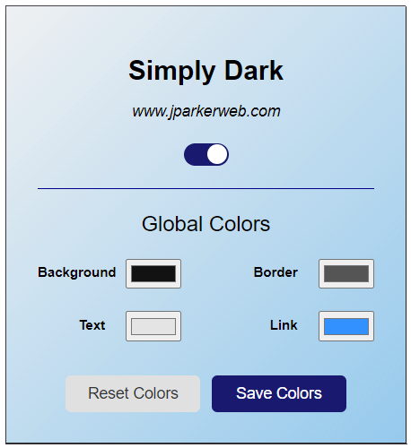

# Simply Dark

Simply Dark is a Chrome extension that provides a customizable dark mode for any website.

## Features

- Toggle dark mode on/off for individual websites
- Customize dark mode colors
- Persistent settings across browser sessions

## Usage

- Click the Simply Dark icon in your browser toolbar to open the popup
- Use the toggle switch to enable/disable dark mode for the current website
- Customize colors using the color pickers in the popup
- Use the keyboard shortcut (Ctrl+Shift+S or Command+Shift+S on Mac) to toggle dark mode

## Customization

You can customize the dark mode colors in the popup. The available options are:

- Background Color
- Text Color
- Link Color
- Border Color

## Contributing

Contributions are welcome! Please feel free to submit a Pull Request.

## License

This project is open source and available under the [MIT License](LICENSE).
